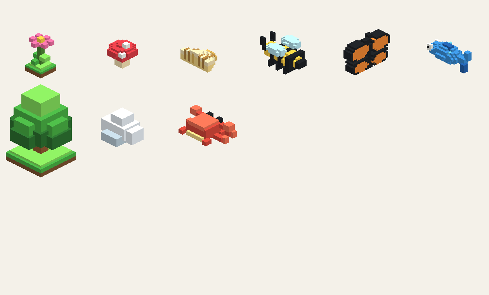
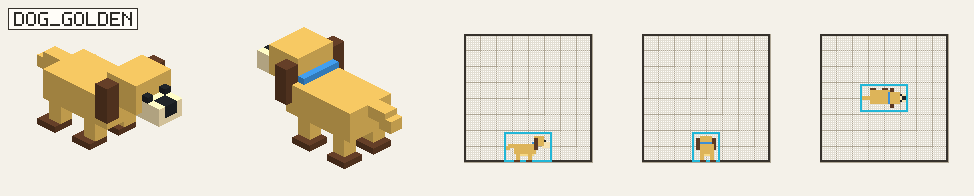
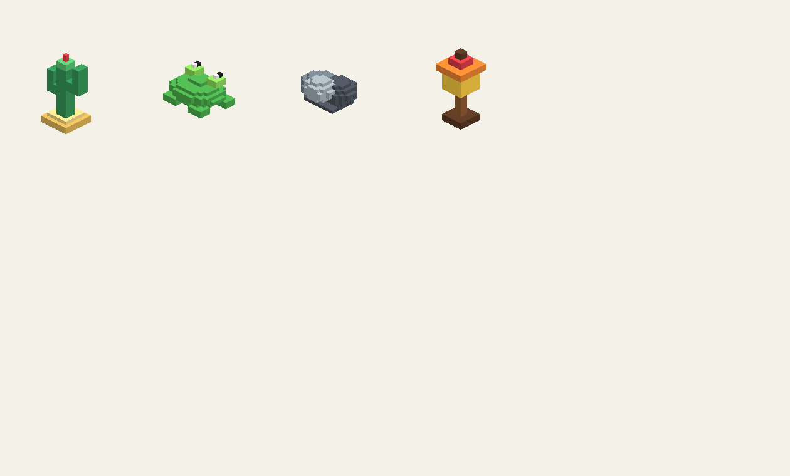
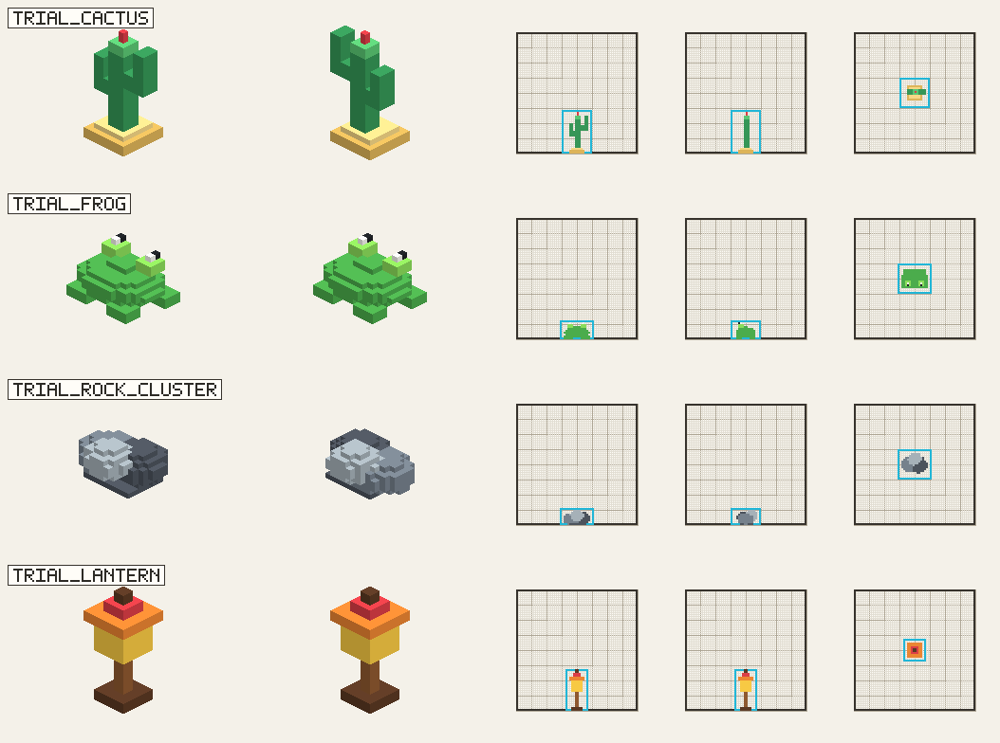

# VoxelAssetPipeline

Standalone workflow for generating, validating, and reviewing small voxel game assets before they are integrated into a game project.

<p align="center">
  
</p>

## What It Does

VoxelAssetPipeline turns an approved visual reference into `.vox` assets with repeatable review steps:

- start from a single source sheet: `Front 3/4 design + Back 3/4 design + Side 64-grid + Front 64-grid + Top 64-grid`
- build small MagicaVoxel-compatible `.vox` files
- render generated `Icon / Front 3/4 / Side / Front / Top` review images
- run structural checks such as `single_connected_component` and `floating_component_sizes`
- review everything in a static browser viewer that also works from `file://`
- optionally apply a game adapter, such as LittleWorld Unity prefab export

## Source Sheet First

The first artifact should be a combined source sheet for exactly one asset. For directional assets such as animals, `Front 3/4` removes the common front/back ambiguity that made side-back icons easy to misread.

This first source sheet must come from a user-provided raster image or an image-generation model. Do not use script-rendered `VoxelModel`, `.vox`, viewer, canvas, SVG, or projection output as the design reference; those are review artifacts after the design source has been approved.

The Side, Front, and Top design views in that first sheet must already show visible 64x64 guides and a bounding cell frame. Each asset should occupy its intended proportion inside the 64-cell frame, not automatically fill it. For batches, repeat the source-sheet approval loop one asset at a time.

Before generating the sheet, decide the scale budget. A single-cell cow should read as a medium asset, for example roughly `40w x 32h x 20d` inside the 64-cell frame, leaving empty grid space around it. Objects larger than that should either use a larger tier or be declared as multi-cell assets instead of being squeezed into one 64-cell frame.

<p align="center">
  
</p>

Only after the source sheet is approved should the pipeline write `.vox` files.

## Review Gallery

| Generated assets | Pipeline reference |
| --- | --- |
|  |  |


## Viewer

Open the static viewer directly:

```text
viewer/index.html
```

If a browser blocks local file access, run the bundled static server:

```powershell
node viewer/server.mjs
```

Then open:

```text
http://127.0.0.1:5177/viewer/index.html
```

The Reference pane shows `Source` first, followed by generated `Icon / Front 3/4 / Side / Front / Top` views.

## Adding a Batch

Create a directory under `examples/` with a `manifest.json`:

```text
examples/missing_batch_01/manifest.json
```

Then rebuild the embedded viewer payload:

```powershell
python voxel_pipeline.py build-viewer-data
```

The viewer scans `examples/*/manifest.json` automatically. You do not need to edit `viewer/app.js` when adding a new batch.

Optional display metadata can be added next to the manifest:

```json
{
  "id": "missing-batch-01",
  "name": "Missing batch 01",
  "cellResolution": 64,
  "order": 100
}
```

## Commands

Run from the repository root:

```powershell
python voxel_pipeline.py generate-design-sheet
python voxel_pipeline.py check-design-sheet

python voxel_pipeline.py generate-quick-trial
python voxel_pipeline.py check-quick-trial

python voxel_pipeline.py generate-dog-trial
python voxel_pipeline.py check-dog-trial

python voxel_pipeline.py build-viewer-data
```

Optional LittleWorld adapter:

```powershell
python voxel_pipeline.py apply-littleworld --project "E:\AI Projects\LittleWorld"
```

## Workflow

1. Generate or provide a source sheet with `Front 3/4 design + Back 3/4 design + Side 64-grid + Front 64-grid + Top 64-grid`.
2. Reject or regenerate it if Side/Front/Top lack visible 64x64 guides, bounding frames, or consistent scale.
3. Stop for human approval of style, direction, silhouette, and occupied 64-cell proportion.
4. Build `.vox` assets from the approved sheet.
5. Render source and generated reference views.
6. Run validators.
7. Rebuild `viewer/embedded-data.js`.
8. Inspect assets in `viewer/index.html`.
9. Apply a project adapter only after approval.

## Codex Skill

This repo includes a distributable Codex skill at:

```text
codex-skills/voxel-generation
```

Git does not install Codex skills automatically. After cloning, install it on Windows PowerShell:

```powershell
powershell -ExecutionPolicy Bypass -File .\scripts\install_codex_skill.ps1
```

The installer copies the skill to:

```text
%USERPROFILE%\.codex\skills\voxel-generation
```

Restart Codex or refresh the skill list after installing. The skill appears as `体素生成` and can be invoked with `$voxel-generation`.

## Repository Map

```text
adapters/              Game-project integration adapters
codex-skills/          Distributable Codex skill package
docs/                  Workflow notes
examples/              Generated sample assets, manifests, and review images
scripts/               Utility scripts
viewer/                Static voxel review UI
voxel_asset_pipeline/  Core model, render, VOX, and validation helpers
workflows/             Asset-family generation and check scripts
```
